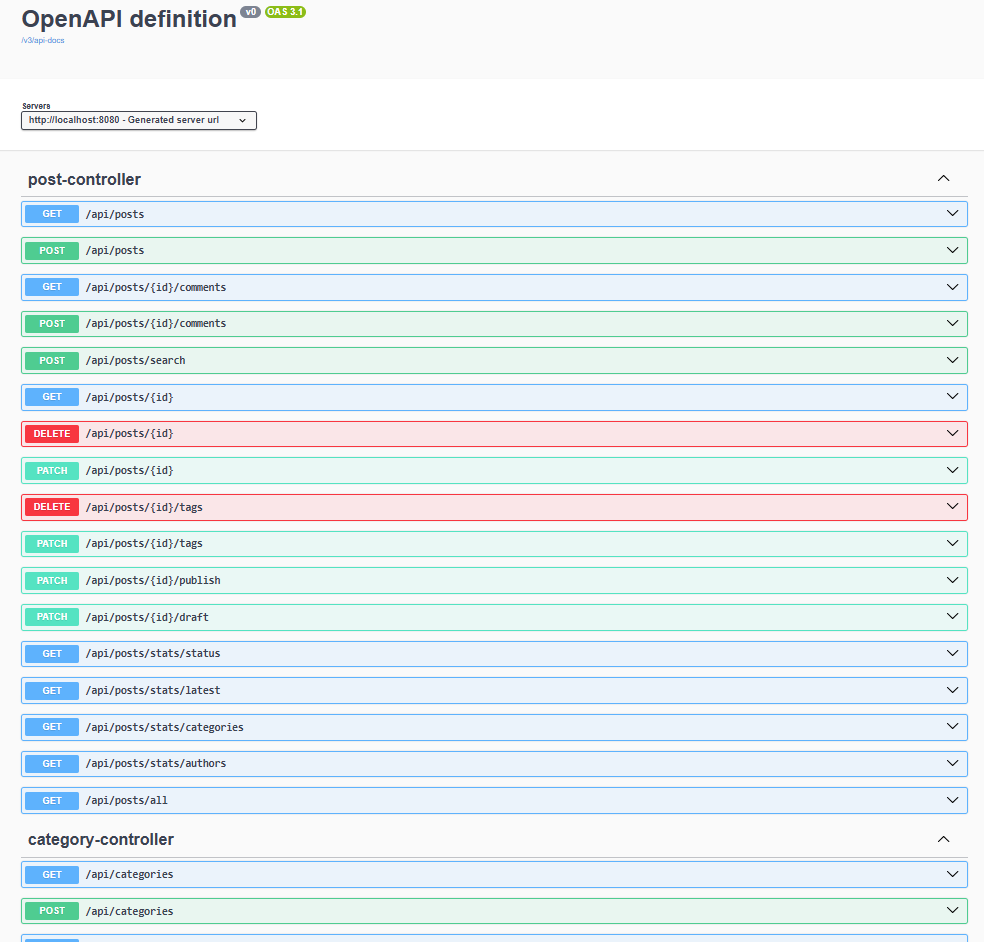
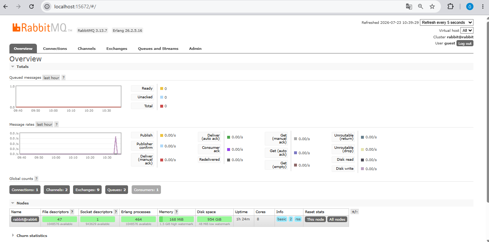
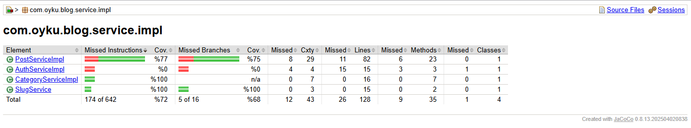

# 📝 Spring Boot Blog CMS REST API

<div align="center">

*A secure and scalable Blog Content Management System (CMS) REST API built with Spring Boot, following layered architecture, clean code principles, and modern backend development practices.*


</div>

---

# 📌 Project Overview

Spring Boot Blog CMS is a secure RESTful backend application developed to manage blog content efficiently.

The project follows a layered architecture and demonstrates modern backend development concepts such as DTO mapping, validation, exception handling, pagination, specifications, JWT authentication, role-based authorization, caching, asynchronous messaging, unit testing, and API documentation.

The application exposes REST APIs for managing:

* Blog posts
* Categories
* Comments
* Tags
* Search operations
* Statistics

Authentication and authorization are implemented using Spring Security and JWT.

The application supports protected endpoints with role-based access control.

To improve performance, Redis caching is integrated for frequently accessed data. Redis-based rate limiting is also implemented to protect API endpoints against excessive requests.

RabbitMQ is used for asynchronous message processing by decoupling background operations from the main request flow.

The project also includes comprehensive unit tests, security integration tests, JaCoCo code coverage analysis, Docker-based infrastructure services, and interactive API documentation using Swagger UI.

---

# 🚀 Features

## 🔐 Authentication & Authorization

The application uses Spring Security with JWT-based authentication.

Features:

* User registration
* User login with JWT token generation
* Stateless authentication
* Password encryption
* Protected REST endpoints
* Role-based authorization
* Authentication filters using JWT


---

## 📝 Post Management

* Create a new post
* Update existing posts
* Delete posts
* Retrieve all posts
* Retrieve a post by ID
* Publish posts
* Save posts as draft
* Retrieve latest posts
* Generate post slugs automatically


---

## 📂 Category Management

* Create category
* Update category
* Delete category
* Retrieve all categories
* Retrieve category by ID


---

## 💬 Comment Management

* Add comments to posts
* Retrieve all comments belonging to a post
* Manage post discussions


---

## 🏷️ Tag Management

* Add tags to posts
* Remove tags
* Prevent duplicate tags
* Manage post-tag relationships


---

## 🔍 Search

Dynamic searching is implemented using Spring Data JPA Specifications.

Users can search posts based on multiple criteria.

Supported operations:

* Search by title
* Search by category
* Search by author
* Search by status
* Combine multiple filtering conditions dynamically


---

## 📄 Pagination

Retrieve posts with paging support.

Features:

* Pageable requests
* Sorting support
* Optimized data retrieval


---

## 📊 Statistics

The API provides statistical endpoints for:

* Categories
* Authors
* Post status


---

## 🚀 Redis Caching

Redis is integrated to improve application performance.

Features:

* Cache frequently accessed blog data
* Reduce unnecessary database queries
* Improve response times
* Automatic cache eviction
* Cache refresh after data modification


---

## 🛡 Redis Rate Limiting

Redis-based rate limiting is implemented to protect REST endpoints.

Features:

* IP-based request limiting
* Prevent excessive API requests
* Protect backend resources
* Returns HTTP 429 (Too Many Requests) when limits are exceeded


---

## 📨 RabbitMQ Messaging

RabbitMQ is used for asynchronous message processing.

Features:

* Publish blog-related events asynchronously
* Consumer-based message processing
* Decoupled background operations
* Improved scalability and responsiveness


---

## ⏰ Scheduled Tasks

Scheduled operations are implemented for background processes.

Features:

* Automatic periodic execution
* Background maintenance operations
* Reduced manual processing requirements


---

## 🧪 Testing

The project includes both unit and integration tests.

Testing technologies:

* JUnit 5
* Mockito
* Spring Boot Test
* MockMvc

Test coverage includes:

* CRUD operations
* Authentication flow
* Authorization rules
* Search functionality
* Tag management
* Comment management
* Validation logic
* Exception scenarios
* Edge cases

Coverage reports are generated using JaCoCo.

---

# 📑 API Documentation

Swagger UI is integrated into the project for interactive API documentation.

The API documentation allows developers to explore and test REST endpoints easily.

After running the application, documentation is available at:

```
http://localhost:8080/swagger-ui/index.html
```

Users can:

* View all available endpoints
* Inspect request/response models
* Execute API requests directly from the browser
* Test endpoints without using Postman
* Authenticate protected endpoints using JWT Bearer tokens

---

# 📷 Swagger Preview

### Swagger Endpoint List



Swagger UI supports authenticated requests using JWT tokens.

---

# 📷 RabbitMQ Management Dashboard

RabbitMQ Management Dashboard displays configured queues and message activity.

It allows monitoring:

* Queue status
* Producer activity
* Consumer activity
* Message processing flow





---

# 📷 JaCoCo Code Coverage

The project uses JaCoCo to analyze test coverage.

Coverage reports include:

* Service layer coverage
* Business logic coverage
* Validation scenarios
* Exception handling coverage





---

# 🛠 Technology Stack

## Backend

```text
Java 17
Spring Boot
Spring MVC
Spring Security
Spring Data JPA
Hibernate
Spring Cache
Spring AMQP
RESTful API
Jakarta Bean Validation
```

## Database

```text
PostgreSQL
pgAdmin
```

## Authentication & Security

```text
JWT (JSON Web Token)
Spring Security
BCrypt Password Encoder
Role-Based Authorization
```

## Caching

```text
Redis
Spring Cache
Redis Rate Limiting
```

## Messaging

```text
RabbitMQ
Spring AMQP
Asynchronous Messaging
```

## Documentation

```text
Swagger / OpenAPI
```

## Testing

```text
JUnit 5
Mockito
Spring Boot Test
MockMvc
JaCoCo
```

## Infrastructure & Utilities

```text
Docker
MapStruct
Lombok
Maven
SLF4J Logging
```

---

# 🏗 Project Architecture

```
src
└── main
    ├── java
    │   └── com.oyku.blog
    │       ├── controller
    │       ├── dto
    │       │     ├── request
    │       │     └── response
    │       ├── entity
    │       ├── enums
    │       ├── exception
    │       ├── mapper
    │       ├── messaging
    │       ├── model
    │       ├── security
    │       │     ├── config
    │       │     ├── handler
    │       │     ├── jwt
    │       │     ├── service
    │       │     └── ratelimit
    │       ├── repository
    │       ├── service
    │       │      └── impl
    │       ├── specification
    │       └── BlogApplication.java
    │
    └── resources
          └── application.properties
```

---

# 🔄 Request Flow

The project follows a layered architecture to ensure separation of concerns, maintainability, and scalability.

```
                     Client
                        │
                        ▼
            Spring Security (JWT)
                        │
                        ▼
          Redis Rate Limiting Filter
                        │
                        ▼
                   Controller
                        │
                        ▼
                    Service
          ┌─────────────┼─────────────┐
          ▼             ▼             ▼
    Repository     Redis Cache    RabbitMQ Producer
          │                           │
          ▼                           ▼
   PostgreSQL Database          RabbitMQ Queue
                                        │
                                        ▼
                              Message Consumer
```


Each layer has a specific responsibility:

Controller
→ Handles HTTP requests and responses.

Service
→ Contains business logic and application rules.

Repository
→ Performs database operations using Spring Data JPA.

Entity
→ Represents database tables.

DTO
→ Transfers data between application layers.

Mapper
→ Converts Entities and DTOs using MapStruct.

Security
→ Handles JWT authentication and authorization.

Redis
→ Provides caching and rate limiting capabilities.

Messaging
→ Handles asynchronous communication with RabbitMQ.

---

# 📦 API Endpoints

## 🔐 Authentication

| Method | Endpoint | Description |
| ------ | -------- | ----------- |
| POST | /api/auth/register | Register a new user |
| POST | /api/auth/login | Authenticate user and generate JWT token |

## Posts

| Method | Endpoint             | Description     |
| ------ | -------------------- | --------------- |
| POST   | /posts               | Create Post     |
| GET    | /posts               | Get All Posts   |
| GET    | /posts/{id}          | Get Post By Id  |
| PUT    | /posts/{id}          | Update Post     |
| DELETE | /posts/{id}          | Delete Post     |
| PATCH  | /posts/{id}/publish  | Publish Post    |
| PATCH  | /posts/{id}/draft    | Draft Post      |
| PATCH  | /posts/{id}/tags     | Add Tags        |
| DELETE | /posts/{id}/tags     | Remove Tags     |
| POST   | /posts/{id}/comments | Add Comment     |
| GET    | /posts/{id}/comments | Get Comments    |
| POST   | /posts/search        | Search Posts    |
| GET    | /posts/latest        | Latest Posts    |
| GET    | /posts/page          | Paginated Posts |

---

## Categories

| Method | Endpoint         | Description             |
| ------ | ---------------- | -----------             |
| POST   | /categories      | Create Category         |
| GET    | /categories      | Retrieve All Categories |
| GET    | /categories/{id} | Retrieve Category by ID |
| PUT    | /categories/{id} | Update Category         |
| DELETE | /categories/{id} | Delete Category         |

---

## Statistics

| Method | Endpoint               | Description                     |
| ------ | ---------------------- | ------------------------------- |
| GET    | /statistics/status     | Retrieve post status statistics |
| GET    | /statistics/authors    | Retrieve author statistics      |
| GET    | /statistics/categories | Retrieve category statistics    |

---

# 🔒 Security

The application secures REST endpoints using Spring Security and JWT Authentication.

The authentication system provides:

* Stateless authentication
* JWT token validation
* Role-based authorization
* Protected API endpoints
* Secure password storage


JWT authentication flow:

1. User logs in with email and password.
2. Server validates credentials.
3. JWT token is generated.
4. Client sends token with each protected request.

Authorization header format:

```
Authorization: Bearer <jwt-token>
```

---

## Role-Based Authorization

| Role | Permissions |
| ---- | ----------- |
| ADMIN | Manage categories, posts and administrative operations |
| USER | Access protected blog resources |

---

# 🛡 Security Configuration

Spring Security configuration includes:

* JWT Authentication Filter
* Custom UserDetailsService
* Authentication Provider
* Password Encoder
* Authentication Entry Point
* Access Denied Handler

Unauthorized requests return proper HTTP security responses.

---

# 🧪 Unit Testing

The project includes both unit tests to ensure application reliability and security.

* JUnit 5
* Mockito

Test coverage includes:

* CRUD operations
* Success scenarios
* Exception scenarios
* Search functionality
* Tag management
* Comment management
* Slug generation
* Edge cases
* Validation logic
* Edge cases

## Code Coverage

The project uses JaCoCo to measure test coverage.

Coverage reports analyze:

* Service layer coverage
* Business logic coverage
* Exception handling
* Validation scenarios

---

# ⚙️ Installation

## Prerequisites

* Java 17
* Maven
* PostgreSQL
* Docker Desktop
* pgAdmin (Optional)
* IntelliJ IDEA or Eclipse

---

## Clone Repository

```bash
git clone https://github.com/OykuEyuboglu/spring-boot-blog-cms.git
```

---

## Navigate to Project

```bash
cd spring-boot-blog-cms
```

---

## Configure Database

Update your database configuration inside:

```
src/main/resources/application.properties
```

```properties
spring.datasource.url=jdbc:postgresql://localhost:5432/blog_db
spring.datasource.username=postgres
spring.datasource.password=your_password
```

Redis configuration:

```properties
spring.data.redis.host=localhost
spring.data.redis.port=6379
```

RabbitMQ configuration:

```properties
spring.rabbitmq.host=localhost
spring.rabbitmq.port=5672
spring.rabbitmq.username=guest
spring.rabbitmq.password=guest
```

JWT configuration:

```properties
jwt.secret=your_secret_key
jwt.expiration=your_expiration_time
```

---

# 🐳 Running Infrastructure Services (Docker Services)

The project uses Docker to run Redis and RabbitMQ services required for caching, rate limiting, and asynchronous messaging.

Start Redis

```
docker run -d --name redis -p 6379:6379 redis
```

Redis will be available at: localhost:6379

Start RabbitMQ

```
docker run -d \
--hostname rabbit \
--name rabbitmq \
-p 5672:5672 \
-p 15672:15672 \
rabbitmq:3-management
```

RabbitMQ Management UI:

```
http://localhost:15672
```

Default credentials:

```
Username: guest
Password: guest
```

## Install Dependencies

```bash
mvn clean install
```

---

## Run Application

```bash
mvn spring-boot:run
```

Application starts at:

```
http://localhost:8080
```

---

## Open Swagger UI

```
http://localhost:8080/swagger-ui/index.html
```

---

# 📚 Key Concepts Covered

This project demonstrates practical experience with:

- Spring Boot
- Spring MVC
- Spring Data JPA
- Hibernate
- PostgreSQL
- Spring Security
- JWT Authentication
- Role-Based Authorization
- REST API Design
- Layered Architecture
- DTO Pattern
- MapStruct
- Global Exception Handling
- Bean Validation
- Pagination
- Dynamic Search using Specifications
- Redis
- Spring Cache
- Redis Rate Limiting
- RabbitMQ
- Spring AMQP
- Asynchronous Messaging
- Docker
- Scheduled Tasks
- Unit Testing with Mockito
- Integration Testing with MockMvc
- Code Coverage with JaCoCo
- Swagger / OpenAPI
- SLF4J Logging
- Clean Code Principles

---

# 👩‍💻 Author

**Dila Öykü Eyüboğlu**

Java & Spring Boot
